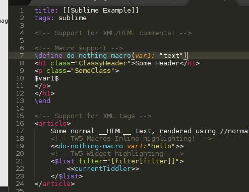

# sublime-tid
Sublime Text 3 syntax file for TiddlyWiki5 *.tid files

This file provides syntax colouring for *.tid files in the Sublime Text 3 editor.

This is a bit of a hack to make raw tiddler editing a bit easier than the wall of white text.

## Installation
Easy way to install the syntax file is to simply drop into the User Package folder.

1. Open Sublime Text 3
2. Open Preferences > Browse Packages...
3. Drop the `tiddler.tmLanguage` file into the open filesytem browser window.

## Build

After making edits to the source file, you may build a new tmLanguage file by following the process found here: http://docs.sublimetext.info/en/latest/extensibility/syntaxdefs.html#prerequisites

## Contribute
Please make improvements and better support for highlighting by submitting issues and especially pull requests.

## Screenshot

